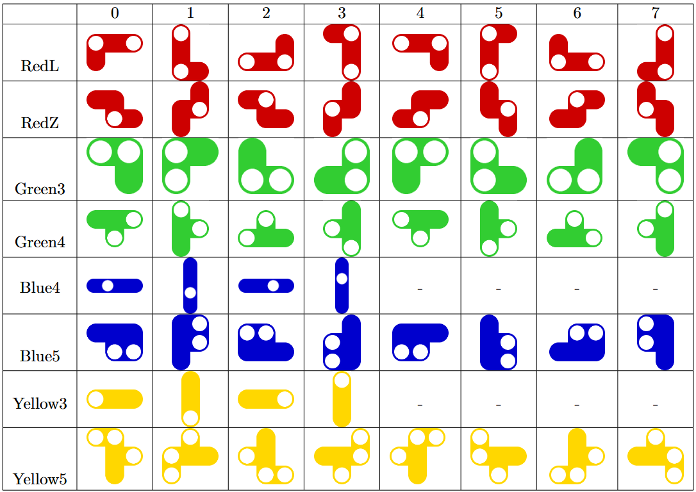

## IQ Twist
This is a game solving project for the logic game called IQ Twist where you have to fit pieces into a frame keeping in mind certain constraints like coloured pins.

It's a really fun game, you can buy it [here](https://www.smartgames.eu/uk/one-player-games/iq-twist), it's perfect for Christmas.
It's a really fun game, you can buy it [here](https://www.smartgames.eu/uk/one-player-games/iq-twist), it's perfect for Christmas.
<div align="center">
  <a href="https://www.smartgames.eu/uk/one-player-games/iq-twist">
    
  </a>
</div>

> [!NOTE]  
> This is not an illegal copy of the game, you cannot move around the pieces and such, it is only meant to implement the algorithm, and display the result in the end.

### Prerequisites

You will need to install [python](https://www.python.org/downloads/) and the pygame package, only for visualization.
* To install pygame just use pip
  ```sh
  pip install pygame
  ```
### Instructions
To use the program, you have to add the initial pieces and pins to the board in the main.py file as lists, then run it.
For example if you want to add a red pin to position '6B' and a greeen pin to '3C', type
```python
exerciseSetup_pins = ['R6B','G3C']
```
and for the green piece with 4 blocks, with rotation 6 and with the top left block being at '4C', type
```python
exerciseSetup_pieces = [['Green4',6,(2,3)]]
```

### Rotations

<!-- <table>
  <tr>
    <th></th>
    <th>0</th>
    <th>1</th>
    <th>2</th>
    <th>3</th>
    <th>4</th>
    <th>5</th>
    <th>6</th>
    <th>7</th>
  </tr>
  <tr>
    <td>RedL</td>
    <td></td>
    <td></td>
    <td></td>
    <td></td>
    <td></td>
    <td></td>
    <td></td>
    <td></td>
  </tr>
  <tr>
    <td>RedZ</td>
    <td></td>
    <td></td>
    <td></td>
    <td></td>
    <td></td>
    <td></td>
    <td></td>
    <td></td>
  </tr>
  <tr>
    <td>Green3</td>
    <td></td>
    <td></td>
    <td></td>
    <td></td>
    <td></td>
    <td></td>
    <td></td>
    <td></td>
  </tr>
  <tr>
    <td>Green4</td>
    <td></td>
    <td></td>
    <td></td>
    <td></td>
    <td></td>
    <td></td>
    <td></td>
    <td></td>
  </tr>
  <tr>
    <td>Blue4</td>
    <td></td>
    <td></td>
    <td></td>
    <td></td>
    <td>-</td>
    <td>-</td>
    <td>-</td>
    <td>-</td>
  </tr>
  <tr>
    <td>Blue5</td>
    <td></td>
    <td></td>
    <td></td>
    <td></td>
    <td></td>
    <td></td>
    <td></td>
    <td></td>
  </tr>
  <tr>
    <td>Yellow3</td>
    <td></td>
    <td></td>
    <td></td>
    <td></td>
    <td>-</td>
    <td>-</td>
    <td>-</td>
    <td>-</td>
  </tr>
  <tr>
    <td>Yellow5</td>
    <td></td>
    <td></td>
    <td></td>
    <td></td>
    <td></td>
    <td></td>
    <td></td>
    <td></td>
  </tr>
</table> -->
